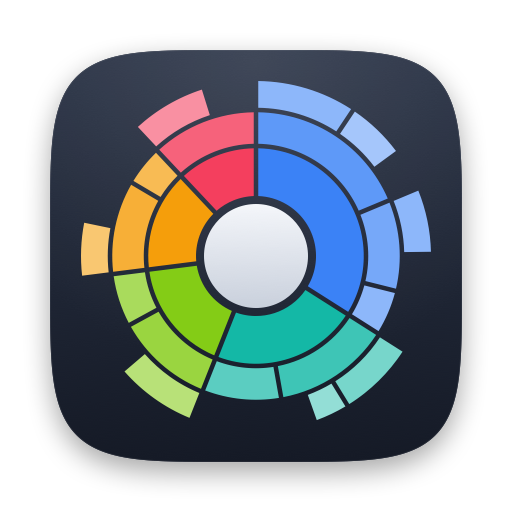
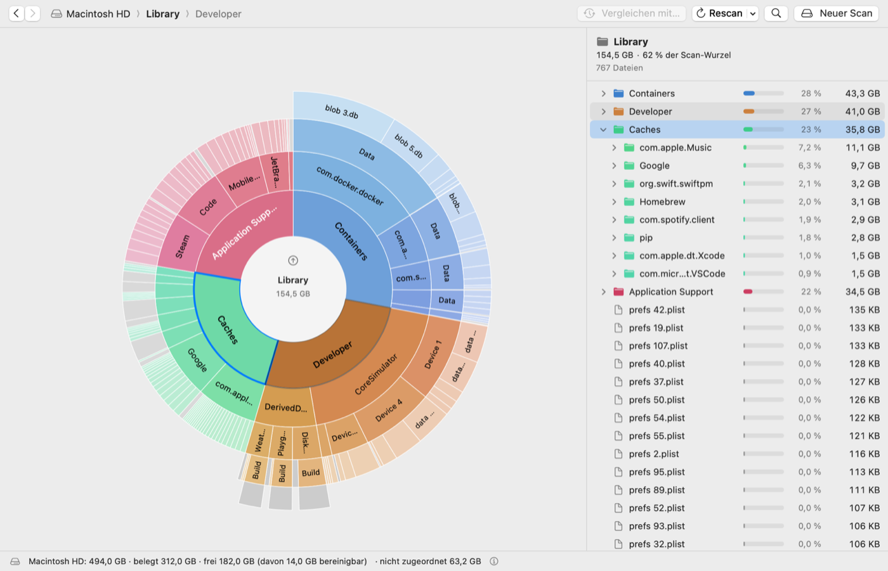
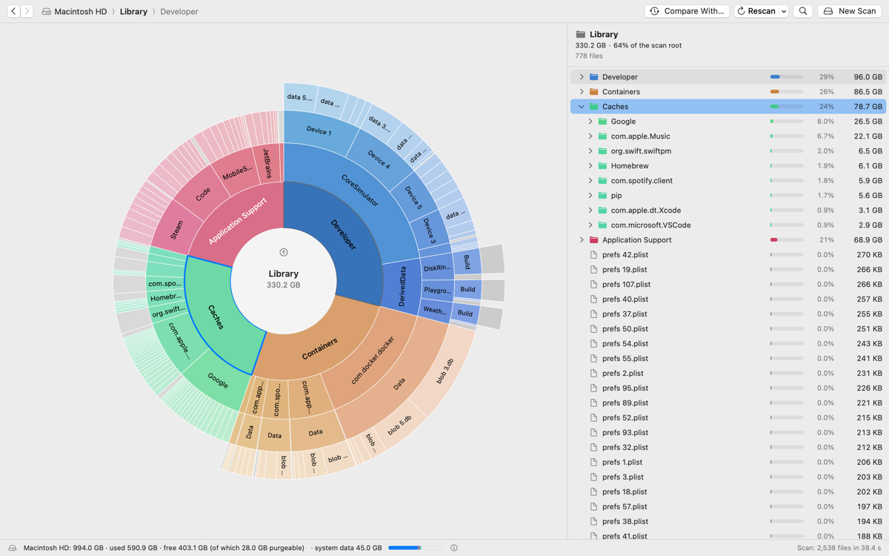
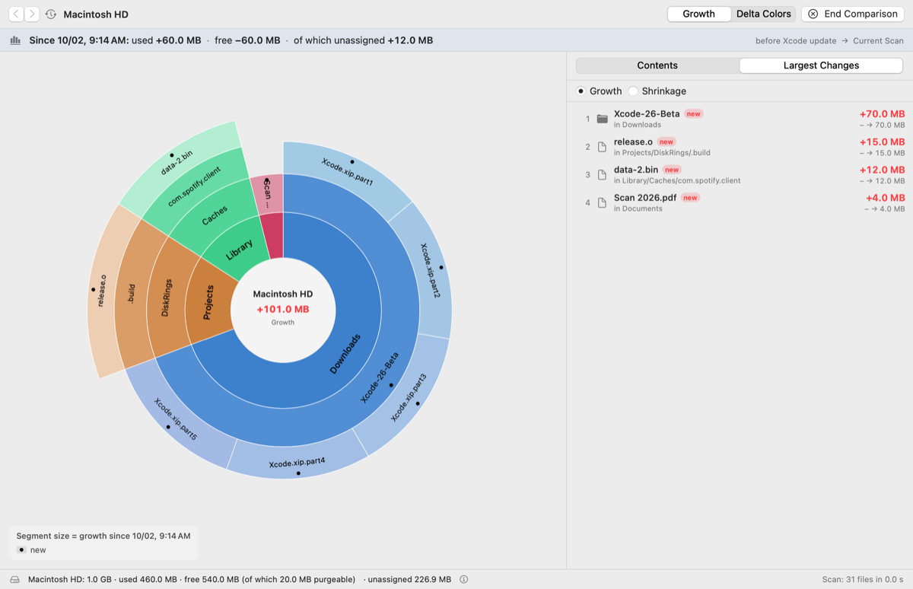
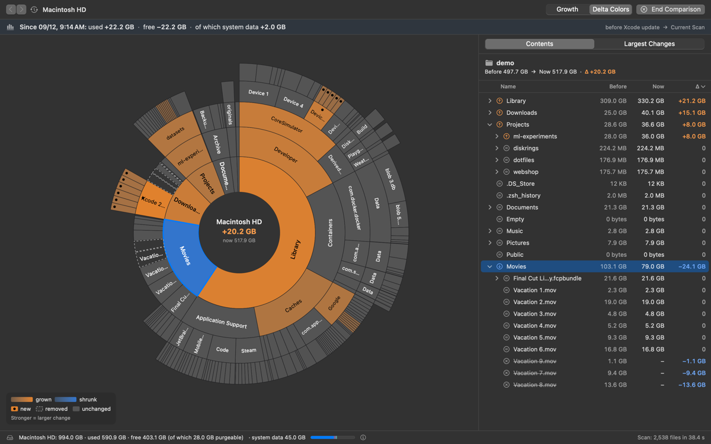
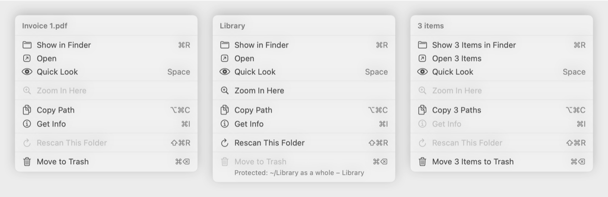
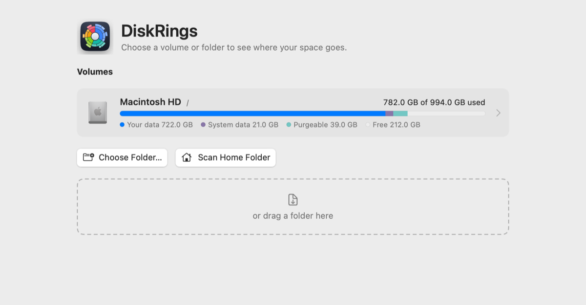

<p align="center"></p>

<h1 align="center">DiskRings</h1>

<p align="center"><b>Free, open-source disk space analyzer for macOS with an interactive sunburst chart.</b><br>
See at a glance what fills your Mac, compare scans over time, and free up space safely.</p>

<p align="center">
  <a href="https://github.com/brokoskokoli/diskrings/actions/workflows/ci.yml"></a>
  <a href="LICENSE"></a>
  
  
  <a href="https://github.com/brokoskokoli/diskrings/releases/latest"></a>
</p>

<p align="center">
  <a href="https://github.com/brokoskokoli/diskrings/releases/latest"><b>Download</b></a> ·
  <a href="https://brokoskokoli.github.io/diskrings/">Website</a> ·
  <a href="#faq">FAQ</a> ·
  <a href="README.de.md">Deutsch</a>
</p>

<picture>
  <source media="(prefers-color-scheme: dark)" srcset="docs/images/hero-dark.png">
  
</picture>

DiskRings scans a volume or folder and draws its disk usage as a sunburst: every ring is one folder level, every segment is as wide as its share of the storage. Click into any folder to zoom, go back with a swipe, and clean up right from the chart. It is a native SwiftUI app for Apple Silicon and Intel Macs, and a macOS alternative to tools like WinDirStat, TreeSize, SpaceSniffer or Scanner on Windows.

> **Languages:** English, German, French, Spanish, Italian, Portuguese (Brazil), Dutch, Polish, Russian, Japanese, Chinese (Simplified), Korean, Turkish and Swedish. DiskRings follows your system language automatically; you can also pick a language in Settings or per app in System Settings → General → Language & Region → Applications. See [Translations](#translations) to improve or add one.

## Features

- **Fast, accurate scanning** of whole volumes or single folders, in parallel via `getattrlistbulk`. DiskRings counts the space actually allocated on disk: hard links only once, sparse and compressed files with their real size, the APFS Data volume firmlinks without double counting, and iCloud files without downloading them.
- **Interactive sunburst chart** with click-to-zoom, animated transitions, back/forward (also with a trackpad swipe) and a breadcrumb bar. Small items are grouped so the chart stays readable.
- **Synchronized detail list** next to the chart, with percentage bars, multi-selection and search.
- **The whole disk at a glance:** at the volume root, the ring also shows **System Data** (other APFS volumes in the container such as Preboot, VM and Recovery, each named, plus unreadable system areas), **Purgeable** space and **Free** space (can be hidden via View → Show Free Space in Ring). The start screen and status bar show the same split as a stacked bar.
- **Snapshots and compare: "Where did my disk space go?"** Save a scan, scan again later and see exactly what grew, what shrank, what is new and what was removed.
- **Safe cleanup:** context menu with Show in Finder, Open, Quick Look, Copy Path, Rescan This Folder and Move to Trash. Deleting only ever moves items to the Trash, asks first, and can be undone with ⌘Z. System locations are protected.
- **Color by branch or by file type**, light and dark mode.
- **Command-line tool** `diskrings-cli` for scans, top folders, snapshots and diffs (handy for scripts).
- **Private by design:** no network access, no telemetry, no account.
- **Localized** into 14 languages, with sizes, numbers and dates formatted for your region.

### Sunburst chart

Every ring is a folder level. Hover for details, click to zoom in, and the list on the right follows along.



### Compare scans: growth view

Pick an earlier snapshot and DiskRings shows only what changed. In the growth view, segment size is the growth since the snapshot, and the list ranks the largest changes.



### Compare scans: delta coloring

The delta coloring keeps the normal layout and paints growth orange and shrinkage blue (distinguishable with red-green color blindness; with “Differentiate without color” shrunk segments are also hatched and marked ±). New items get a dot, removed items appear as dashed outlines.



### Context menu

The same actions in the chart, the list and the menu bar. Protected items explain why they can't be trashed.



### Start screen

Pick a volume, choose a folder, or drop one onto the window.



## Why DiskRings?

There are good disk usage tools for the Mac already. Each has its own focus:

| | DiskRings | DaisyDisk | GrandPerspective | OmniDiskSweeper |
|---|---|---|---|---|
| Visualization | Sunburst + list | Sunburst | Treemap | Sorted list |
| Compare scans over time | Yes (snapshots) | No | No | No |
| Shows space outside folders (system data, purgeable, free) | Yes | Yes (as hidden space) | No | No |
| Delete | Trash only, with undo | Yes | Yes | Yes |
| Price | Free, open source (MIT) | Paid | Free, open source | Free |

What makes DiskRings different:

- **Snapshot compare.** Answer "where did my disk space go since last week?" instead of hunting through the whole disk again.
- **Honest totals.** The scan sum plus System Data plus Purgeable equals the used space reported by the volume, so other volumes, APFS snapshots and purgeable space don't silently disappear.
- **Safe by default.** There is no permanent delete. Everything goes to the Trash, with a confirmation and ⌘Z undo, and system paths are protected.
- **Fast.** On an M3 Pro, a home folder with 2.9 million files and folders is scanned in about 10 seconds (`du -sk` needs 65 s for the same folder). Comparing two snapshots with 2 million entries each takes about 0.3 s. Details are in [dev/PERFORMANCE.md](dev/PERFORMANCE.md).
- **Free and open source**, with no in-app purchases, no ads and no data collection.

## Installation

### Download

1. Download the latest **DMG** from [Releases](https://github.com/brokoskokoli/diskrings/releases/latest).
2. Open it and drag **DiskRings** into **Applications**.
3. Start it. The app is signed with a Developer ID and notarized by Apple.

Requirements: macOS 14 (Sonoma) or later, Apple Silicon or Intel.

### Homebrew

Planned.

### Full Disk Access (recommended)

Without Full Disk Access, DiskRings still works, but macOS hides folders like `~/Library/Mail`, `~/Library/Messages`, Safari data and other apps' containers. They show up as unreadable, and their space is counted as "Unreadable System Data". To grant access:

1. Open **System Settings → Privacy & Security → Full Disk Access** (or click the button on the DiskRings start screen).
2. Click **+**, add **DiskRings** from Applications, and turn the switch on.
3. Restart DiskRings.

DiskRings only reads file sizes and metadata. It never opens or uploads your files.

### Build from source

DiskRings is a Swift package without an Xcode project. The Command Line Tools with Swift 6 are enough (`xcode-select --install`); Xcode is optional.

```sh
git clone https://github.com/brokoskokoli/diskrings.git
cd diskrings
scripts/check.sh                       # build and run all tests
DISKRINGS_ADHOC=1 scripts/make-app.sh  # build/DiskRings.app (release, universal, ad-hoc signed)
open build/DiskRings.app
```

Command-line tool:

```sh
swift run -c release diskrings-cli scan ~ --top 10 --depth 2
swift run -c release diskrings-cli scan / --json
swift run -c release diskrings-cli volumes
```

UI previews and Mac App Store screenshots (demo data only, nothing is scanned):

```sh
swift run DiskRings --render-snapshots build/snapshots        # PNGs of many views, light and dark
swift run DiskRings --store-screenshots build/store --language en --appearance dark   # 2880×1800
```

## Publishing a new version

Releases are built, signed with the Developer ID, notarized by Apple and published by the GitHub Actions workflow [`release.yml`](.github/workflows/release.yml) when a `v*` tag is pushed. The version lives in [`VERSION`](VERSION) and uses [semantic versioning](https://semver.org).

```sh
# 1. Bump the version on main (CI must be green)
echo 0.2.0 > VERSION
git commit -am "Version 0.2.0"
git push origin main

# 2. Tag it; the tag must match VERSION
git tag -a v0.2.0 -m "DiskRings 0.2.0"
git push origin v0.2.0
```

3. Approve the run: **Actions → Release → Review deployments → `release` → Approve and deploy** (the `release` environment requires a maintainer's approval).
4. After about 5–10 minutes the release with DMG, ZIP and `SHA256SUMS` appears under [Releases](https://github.com/brokoskokoli/diskrings/releases), with release notes generated from the commits.

Before a release you can do a dry run that builds, signs and notarizes without publishing: `gh workflow run release.yml -f dry_run=true`. Only repository admins can create `v*` tags. A local release without CI is possible with `scripts/release.sh --publish`. One-time setup, secrets, troubleshooting and security trade-offs: [dev/RELEASING.md](dev/RELEASING.md) (German).

## FAQ

### Why does DiskRings show a different size than the Finder?

The Finder usually shows the logical file size (the number of bytes in the file). DiskRings shows the space allocated on disk, like `du`. They differ for compressed and sparse files, many small files (block size), and hard links, which DiskRings counts only once. APFS clones share blocks, but macOS has no public API to detect that, so cloned files can make a folder total look larger than the space it really uses.

### What are "System Data", "Purgeable" and "Free"?

When you scan a whole volume, DiskRings splits the space that appears in no folder (used space minus the scan sum):

- **System Data:** the other APFS volumes in the same container (Preboot, VM for swap and sleep image, Recovery, Update, or your own volumes such as a Nix store), each with its name and size, plus **Unreadable System Data**: the rest, e.g. the Spotlight index, document versions, `/private/var/db`, APFS metadata and – without Full Disk Access – the folders DiskRings wasn't allowed to read.
- **Purgeable:** space macOS frees on demand (caches, iCloud files, local snapshots).
- **Free:** really unused space, drawn light grey.

Local APFS and Time Machine snapshots can't be measured separately without administrator rights; depending on their state they count as Purgeable or Unreadable System Data. Older versions showed all of this as one grey "Unassigned" segment.

### Is deleting safe?

DiskRings never deletes permanently. "Move to Trash" uses the system Trash, asks for confirmation with name, size and file count, and can be undone with ⌘Z. The root of a volume, your home folder as a whole, `~/Library` as a whole, system locations such as `/System` and `/usr`, and the app itself are protected and cannot be trashed. Undo checks that the item in the Trash is still the same one before restoring it.

### Does it work on external drives and network volumes?

Yes. Any mounted volume or folder you can read can be scanned. Network volumes are slower because every directory listing goes over the network.

## Privacy

DiskRings makes no network connections and contains no telemetry, analytics or crash reporting. Scan results and snapshots stay on your Mac (`~/Library/Application Support/DiskRings`).

## Contributing

Issues and pull requests are welcome, especially translations, bug reports with steps to reproduce, and performance measurements on other Macs.

- Run `scripts/check.sh` before submitting. It must pass without warnings.
- All logic lives in `Sources/DiskRingsCore` and is covered by tests in `Tests/DiskRingsCoreTests`. The SwiftUI app in `Sources/DiskRings` stays thin.
- The specification is in [SPEC.md](SPEC.md) and design decisions are in [dev/DECISIONS.md](dev/DECISIONS.md) (both in German).

## Translations

The translations were created with machine assistance and reviewed for Apple's macOS terminology, but not yet by native speakers of every language. Corrections are very welcome.

- All texts live in `Sources/DiskRingsCore/Resources/<language>.lproj/`: `Localizable.strings` (UI texts), `Localizable.stringsdict` (plural forms) and `InfoPlist.strings` (the privacy texts macOS shows). English (`en.lproj`) is the source.
- **Improve a language:** edit the values in that folder and open a pull request. Keep the keys and placeholders (`%@`, `%1$@`, `%2$@`, …) unchanged; you may reorder positional placeholders.
- **Add a language:** copy `en.lproj` to `<code>.lproj` (e.g. `cs.lproj`), translate it, provide the plural categories your language needs in the `.stringsdict`, and add the code and the language's own name to `L10n.supportedLanguages` and `L10n.nativeName(of:)` in `Sources/DiskRingsCore/Localization/L10n.swift`.
- `scripts/check.sh` runs tests that catch missing or extra keys, mismatched placeholders and missing plural forms.
- Screenshots in any language: `swift run DiskRings --render-snapshots build/snapshots/fr --language fr`.

## License

DiskRings is released under the [MIT License](LICENSE). Copyright © 2026 Stefan Richter.
