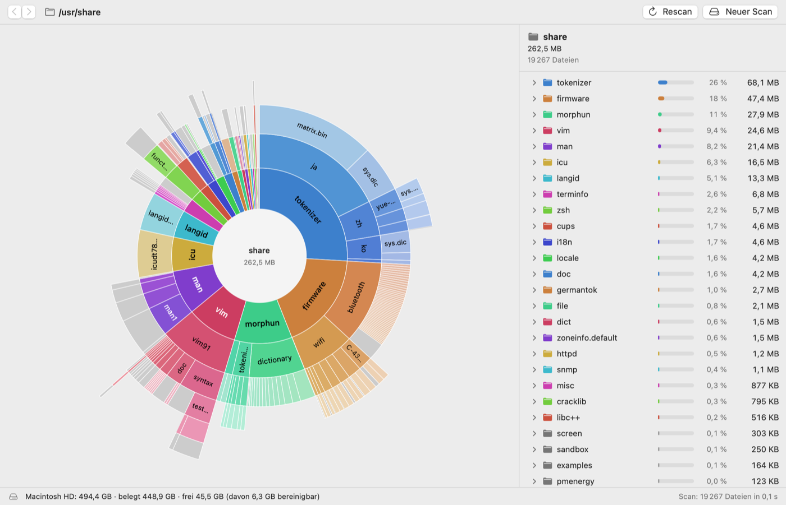
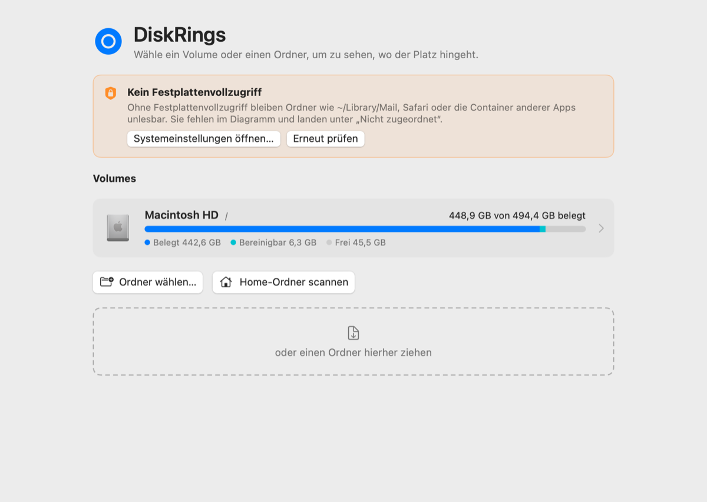

<p align="center"></p>

# DiskRings

Festplatten-Analysator für macOS. DiskRings zeigt die Belegung eines Volumes oder Ordners als Sunburst-Diagramm: Jeder Ring ist eine Ordnerebene, jedes Segment so breit wie sein Anteil am Speicher. So sieht man auf einen Blick, wo der Platz hingeht.



## Was die App kann

- **Schneller Scan** ganzer Volumes oder einzelner Ordner, parallel über `getattrlistbulk`. Gezählt wird der tatsächlich belegte Platz: Hardlinks nur einmal, Sparse- und komprimierte Dateien mit ihrer echten Belegung, Firmlinks des Data-Volumes ohne Doppelzählung, iCloud-Dateien ohne Download.
- **Sunburst-Diagramm** mit Drill-down per Klick, animiertem Zoom, Zurück/Vor (auch per Wischgeste) und Breadcrumb. Kleine Elemente landen in einem Sammelsegment. An der Volume-Wurzel zeigt ein schraffiertes Segment, was der Scan nicht zuordnen konnte (System, Snapshots, unlesbare Ordner).
- **Detailliste** neben dem Diagramm mit Prozentbalken, synchronisiert mit dem Diagramm (Hover und Auswahl).
- **Kontextmenü** in Diagramm und Liste: Im Finder zeigen, Öffnen, Quick Look, Pfad kopieren, Teilbereich neu scannen, in den Papierkorb legen.
- **Färbung** nach Ast oder nach Dateityp, hell und dunkel.
- **Snapshots und Vergleich** („Wo ist mein Speicher hin?“): einen Scan speichern und später mit einem neuen vergleichen, um zu sehen, was gewachsen ist.
- **Kommandozeilen-Werkzeug** `diskrings-cli` für Scan, Top-Ordner, Snapshots und Vergleich.
- Keine Netzwerkzugriffe, keine Telemetrie.


<p align="center"></p>

## Installation

1. Die aktuelle Version unter [Releases](https://github.com/brokoskokoli/diskrings/releases) laden, als DMG oder ZIP.
2. DMG öffnen und **DiskRings** in den Ordner **Programme** ziehen (beim ZIP: entpacken und verschieben).
3. Starten. Die App ist mit Developer ID signiert und von Apple notarisiert; Gatekeeper fragt nur einmal nach, ob sie geöffnet werden soll.

Voraussetzung: macOS 14 (Sonoma) oder neuer, Apple Silicon oder Intel.

## Festplattenvollzugriff einrichten

Ohne Festplattenvollzugriff funktioniert DiskRings, kann aber Ordner wie `~/Library/Mail`, `~/Library/Messages`, Safari-Daten und die Container anderer Apps nicht lesen. Sie erscheinen dann als „nicht lesbar“, und ihr Platz landet unter „Nicht zugeordnet“. Der Startbildschirm weist darauf hin.

1. **Systemeinstellungen → Datenschutz & Sicherheit → Festplattenvollzugriff** öffnen (oder in DiskRings auf „Systemeinstellungen öffnen …“ klicken).
2. Mit **+** die App `DiskRings` aus dem Ordner Programme hinzufügen und den Schalter einschalten.
3. DiskRings neu starten (oder im Startbildschirm „Erneut prüfen“).

## Bauen aus dem Quellcode

Ein Swift Package ohne Xcode-Projekt. Es genügen die **Command Line Tools** (`xcode-select --install`) mit Swift 6; Xcode ist optional.

```sh
scripts/check.sh                       # Build, alle Tests, Performance-Tests im Release-Build
scripts/make-app.sh                    # build/DiskRings.app (Release, universal, signiert)
open build/DiskRings.app
DISKRINGS_ADHOC=1 scripts/make-app.sh  # ohne Developer ID: ad-hoc-Signatur
```

`make-app.sh` signiert mit der Developer ID aus dem Schlüsselbund, wenn sie vorhanden ist, sonst ad hoc. Beim ersten Mal kann macOS nach der Freigabe des Schlüssels fragen; dann im Dialog „Immer erlauben“ wählen. Hängt codesign länger als 60 s (Dialog unsichtbar), bricht das Skript mit einem Hinweis ab.

Kommandozeile und Vorschaubilder:

```sh
swift run -c release diskrings-cli scan ~ --top 10 --depth 2
swift run -c release diskrings-cli scan / --json
swift run -c release diskrings-cli volumes
swift run DiskRings --render-snapshots build/snapshots --scan /usr/share   # PNGs, hell/dunkel
swift scripts/make-icon.swift          # App-Icon neu erzeugen (Resources/DiskRings.icns)
```

Die Version steht in der Datei [`VERSION`](VERSION), die Build-Nummer ist die Anzahl der git-Commits.

Weitere Dokumente: [SPEC.md](SPEC.md) (Spezifikation), [docs/DECISIONS.md](docs/DECISIONS.md) (Entscheidungen), [docs/PERFORMANCE.md](docs/PERFORMANCE.md) (Messwerte).

## Release-Ablauf

Signieren und Notarisieren laufen lokal, nicht in der CI. Die CI (GitHub Actions) baut nur und führt die Tests aus.

Einmalig das Notarisierungs-Profil im Schlüsselbund anlegen (mit einem app-spezifischen Passwort der Apple-ID):

```sh
xcrun notarytool store-credentials diskrings --apple-id <apple-id> --team-id AGRWTKQZ8C
```

Dann:

1. `VERSION` erhöhen und committen.
2. `scripts/release.sh` ausführen. Das Skript
   - führt `scripts/check.sh` und `scripts/make-app.sh` aus,
   - reicht die App zur Notarisierung ein und heftet das Ticket an (`stapler`),
   - erzeugt `dist/DiskRings-<version>.zip` (ditto) und `dist/DiskRings-<version>.dmg` (mit Link auf Programme), signiert, notarisiert und heftet auch das DMG,
   - prüft beides mit `spctl` und schreibt `dist/SHA256SUMS`.
3. Mit `scripts/release.sh --publish` legt das Skript am Ende zusätzlich das GitHub-Release `v<version>` mit ZIP, DMG, `SHA256SUMS` und automatisch erzeugten Notizen an (Voraussetzung: sauberes Arbeitsverzeichnis, Tag existiert noch nicht). Ohne `--publish` liegt alles in `dist/`.

Fehlt das Profil, bricht `release.sh` vor der Notarisierung mit dieser Anleitung ab; nach dem Anlegen genügt `scripts/release.sh --skip-checks`.

## Lizenz

Noch offen.
